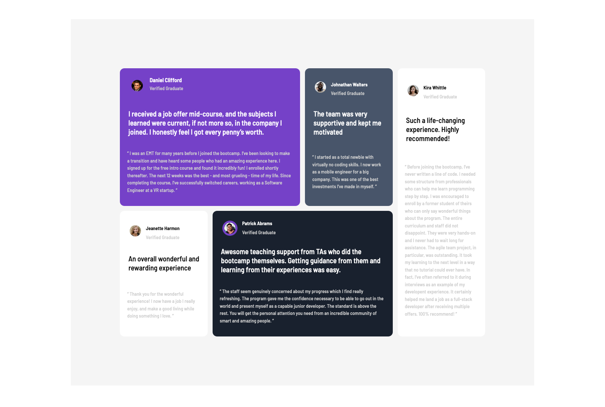

# Frontend Mentor - Testimonials grid section solution

This is a solution to the [Testimonials grid section challenge on Frontend Mentor](https://www.frontendmentor.io/challenges/testimonials-grid-section-Nnw6J7Un7). Frontend Mentor challenges help you improve your coding skills by building realistic projects.

## Table of contents

- [Overview](#overview)
  - [The challenge](#the-challenge)
  - [Screenshot](#screenshot)
  - [Links](#links)
- [My process](#my-process)
  - [Built with](#built-with)
  - [What I learned](#what-i-learned)
  - [Continued development](#continued-development)
  - [Useful resources](#useful-resources)
- [Author](#author)

## Overview

### The challenge

Users should be able to:

- View the optimal layout for the site depending on their device's screen size

### Screenshot



### Links

- Solution URL: [Add solution URL here](https://your-solution-url.com)
- Live Site URL: [Add live site URL here](https://your-live-site-url.com)

## My process

### Built with

- Semantic HTML5 markup
- CSS custom properties
- Flexbox
- CSS Grid

### What I learned

this challenge helped me practice my skills with css and css grid to design moderate layouts.

```css
:root {
    --moderate-violet: hsl(263, 55%, 52%);
    --very-dark-grayish-blue: hsl(217, 19%, 35%);
    --very-dark-blackish-blue: hsl(219, 29%, 14%);
    --white: hsl(0, 0%, 100%);
    --light-gray: hsl(0, 0%, 81%);
    --light-grayish-blue: hsl(210, 46%, 95%);
}

body {
    height: 100vh;
    width: auto;
    font-size: 13px;
    font-family: 'Barlow Semi Condensed', sans-serif;
}

.container {
    display: grid;
    grid-template-columns: 1fr;
    grid-template-rows: 1fr;
    grid-template-areas: "card";
    height: auto;
    grid-auto-flow: auto;
}

.card {
    grid-area: card;
}

.card {
    display: grid;
    grid-template-columns: repeat(4, 1fr);
    grid-template-rows: repeat(2, 1fr);
    grid-template-areas: "daniel daniel johnathan kira" "jeanette patrick patrick kira ";
    grid-gap: 1em;
    justify-content: space-evenly;
    margin: 180px;
    background-color: whitesmoke;
    padding: 10em;
}

.daniel {
    grid-row: 1/3;
    grid-column: 1/3;
    background-color: var(--moderate-violet);
    border-radius: 12px;
    color: white;
}
```

### Continued development

I plan to continue my skills in css grid, flexbox, and mobile first development.

## Author

- Website - [Makram Ibrahim](https://www.sleepingpharaoh.com)
- Frontend Mentor - [@pharaohmak](https://www.frontendmentor.io/profile/pharaohmak)
- Twitter - [@pharaohmak](https://www.twitter.com/pharaohmak)
